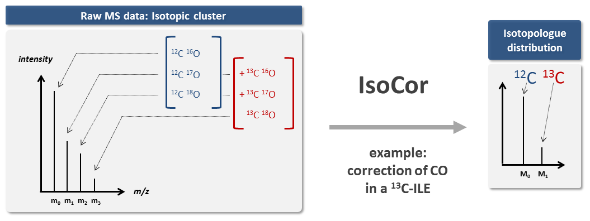

MultiNMRFit: Fitting of 1D NMR Data
********************************************************************************

Welcome to MultiNMRFit documentation!
----------------------------------------

**MultiNMRFit is a scientific software dedicated to the analysis of 1H NMR data **.
MultiNMRFit: Semi-automated software for the analysis of 1H NMR .

It is one of the routine tools that we use at the `NMR team <http://www.toulouse-biotechnology-institute.fr/en/research/physiology-and-engineering-of-microbial-metabolism/rmn.html>`_ and `MetaSys team <http://www.toulouse-biotechnology-institute.fr/en/research/molecular-physiology-and-metabolism/metasys.html>`.

The code is open-source, and available on `GitHub <https://github.com/NMRTeamTBI/MultiNMRFit>`_ under a :ref:`GPLv3 license <license>`.

This documentation is available on Read the Docs (`https://isocor.readthedocs.io <https://isocor.readthedocs.io/>`_)
and can be downloaded as a `PDF file <https://readthedocs.org/projects/isocor/downloads/pdf/latest/>`_.

.. rubric:: Key features

* **correction of naturally occuring isotopes**, both for non-tracer and tracer elements,
* **correction of tracer purity**,
* shipped as a library with both a **graphical and command line interface**,
* mass-spectrometer and :ref:`resolution <resolution>` agnostic,
* can be applied to singly- and multiply-charged ions
* can be used with any tracer element (having two or more isotopes)
* account for the contribution of derivatization steps (if any),
* generate InChIs of isotopically-resolved (tracer) isotopologues,
* open-source, free and easy to install everywhere where Python 3 and pip run,
* biologist-friendly.

.. seealso:: We strongly encourage you to read the :ref:`Tutorials` before using IsoCor.

