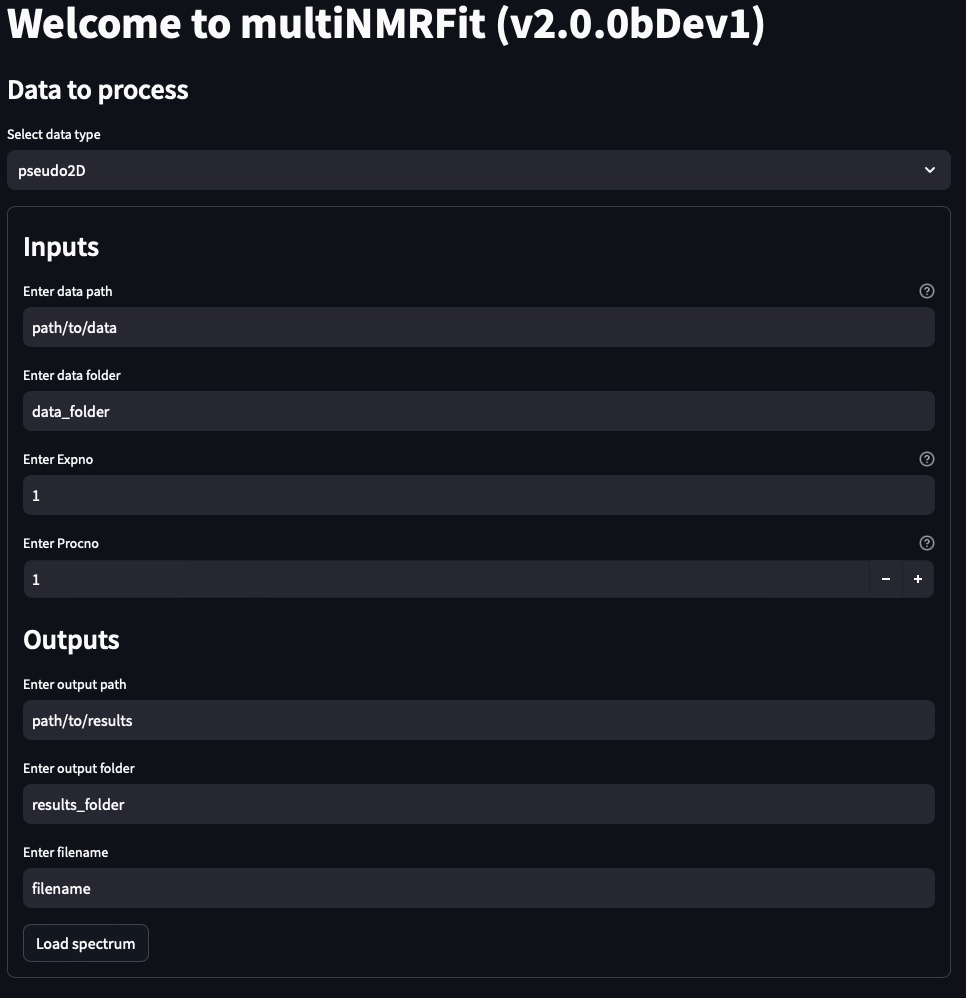

..  _Quick start:

Quick start
********************************************************************************

Installation
------------------------------------------------

MultiNMRFit requires Python 3.8 or higher. If you do not have a Python environment
configured on your computer, we recommend that you follow the instructions
from `Anaconda <https://www.anaconda.com/download/>`_.

Then, open a terminal (e.g. run *Anaconda Prompt* if you have installed Anaconda) and type:

.. code-block:: bash

  pip install multinmrfit

You are now ready to start MultiNMRFit.

If this method does not work, you should ask your local system administrator or
the IT department "how to install a Python 3 package from PyPi" on your computer.

Alternatives & update
^^^^^^^^^^^^^^^^^^^^^^^^^^^^^^^^^^^^^^^^

If you know that you do not have permission to install software systemwide,
you can install MultiNMRFit into your user directory using the :samp:`--user` flag:

.. code-block:: bash

  pip install --user multinmrfit

If you already have a previous version of MultiNMRFit installed, you can upgrade it to the latest version with:

.. code-block:: bash

  pip install --upgrade multinmrfit

Alternatively, you can also download all sources in a tarball from `GitHub <https://github.com/NMRTeamTBI/MultiNMRFit>`_,
but it will be more difficult to update MultiNMRFit later on.

Usage
------------------------------------------------

Graphical User Interface
^^^^^^^^^^^^^^^^^^^^^^^^^^^^^^^^^^^^^^^^

To start the Graphical User Interface, type in a terminal (Windows: *Anaconda Prompt*):

.. code-block:: bash

  nmrfit

The MultiNMRFit window will open. If the window fails to open, have a look at our
:ref:`dedicated troubleshooting procedure <failed_gui>` to solve the problem.

Fill the required entries from the **Inputs** and **Outputs** sections and 
click on :samp:`Load data`. A message ("Dataset loaded successfully") will indicate your data are correctly loaded, otherwise check your inputs (path or data type).

.. note:: The process is continuously and automatically saved as a pickle file in the output folder. To reopen the current processing state, just reopen this file by clicking on "Load a processing file - Browse files" on the side bar at the left.

Data types include **pseudo2D**, **list of 1Ds** and **txt data**.

.. warning:: MultiNMRFit silently overwrites (results and processing) files if they already exist. So take care to copy your results elsewhere or to change the output path and/or filename if you want to protect them from overwriting.

Library
^^^^^^^^^^^^^^^^^^^^^^^^^^^^^^^^^^^^^^^^

MultiNMRFit is also available as a library (a Python module) that you can import directly in your Python
scripts:

.. code-block:: python

  import multinmrfit
