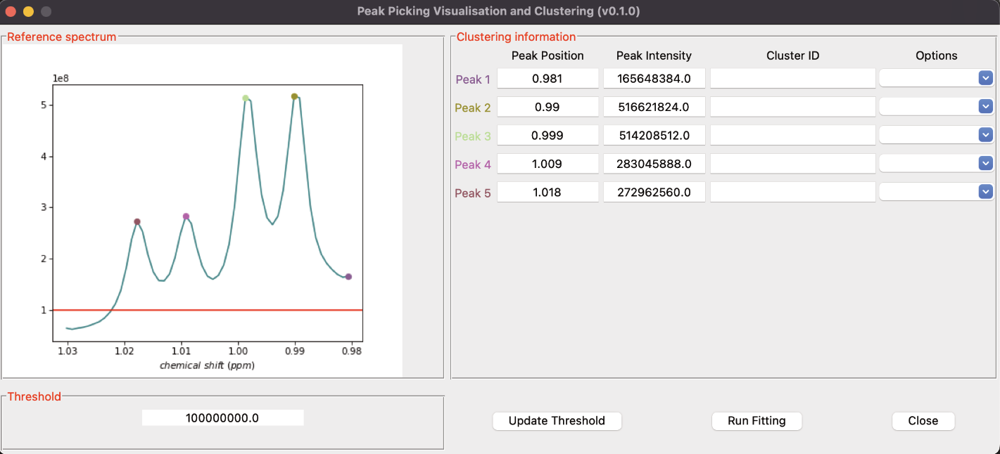

..  _Quick start:

Quick start
********************************************************************************

Installation
------------------------------------------------

MultiNMRFit requires Python 3.5 or higher. If you do not have a Python environment
configured on your computer, we recommend that you follow the instructions
from `Anaconda <https://www.anaconda.com/download/>`_.

Then, open a terminal (e.g. run *Anaconda Prompt* if you have installed Anaconda) and type:

.. code-block:: bash

  pip install multinmrfit

You are now ready to start MultiNMRFit.

If this method does not work, you should ask your local system administrator or
the IT department "how to install a Python 3 package from PyPi" on your computer.

Alternatives & update
^^^^^^^^^^^^^^^^^^^^^^^^^^^^^^^^^^^^^^^^

If you know that you do not have permission to install software systemwide,
you can install MultiNMRFit into your user directory using the :samp:`--user` flag:

.. code-block:: bash

  pip install --user multinmrfit

If you already have a previous version of MultiNMRFit installed, you can upgrade it to the latest version with:

.. code-block:: bash

  pip install --upgrade multinmrfit

Alternatively, you can also download all sources in a tarball from `GitHub <https://github.com/NMRTeamTBI/MultiNMRFit>`_,
but it will be more difficult to update MultiNMRFit later on.

Usage
------------------------------------------------

Data Loading via Graphical User Interface
^^^^^^^^^^^^^^^^^^^^^^^^^^^^^^^^^^^^^^^^

To start the Graphical User Interface, type in a terminal (Windows: *Anaconda Prompt*):

.. code-block:: bash

  multinmrfit

The MultiNMRFit window will open. If the window fails to open, have a look at our
:ref:`dedicated troubleshooting procedure <failed_gui>` to solve the problem.

.. image:: _static/multinmrfit_load_gui.png

Fill al the required entries from the **inputs**, **analysis** and **outputs** sections. **Options** might me used accordingly to your need and 
click on :samp:`Run`. If you want to save your configuration file click on :samp:`Save` and a small window will pop up in which you can specify the name. 
If your config file is already created, click on :samp:`Load` that will fill all fields. 

.. note:: The saving of the configuration file is not automatic.

When :samp:`Run` is cliked it will display the visualization and clustering window (see below).

.. note:: MultiNMRFit silently overwrites (results and log) files if they already exist. So take care to copy your results elsewhere if you want to protect them from overwriting.

Data Loading via Command Line Interface
^^^^^^^^^^^^^^^^^^^^^^^^^^^^^^^^^^^^^^^^

To process your data, type in a terminal:

.. code-block:: bash

  multinmrfit [path/config_file.json]

where path/config_file.json is the path to the configuration file tha

.. argparse::
   :module: isocor.ui.isocorcli
   :func: parseArgs
   :prog: isocorcli
   :nodescription:

MultiNMRFit will display the visualization and clustering window (see below).

.. seealso:: Tutorial :ref:`First time using MultiNMRFit` has example of configuration file.

Data Loading via Command Line Interface
^^^^^^^^^^^^^^^^^^^^^^^^^^^^^^^^^^^^^^^

MultiNMRFit automatically detects peaks above the threshold given previously either by the loading ui or in the congiguration file. 
If the **threshold** is too low (c.a not peaks are detected)

.. warning:: The correction options must be carefully selected to ensure reliable interpretations of labeling data, as detailed in the :ref:`Tutorials`.

.. seealso:: Tutorial :ref:`First time using IsoCor` has example data
            that you can use to test your installation.

Library
^^^^^^^^^^^^^^^^^^^^^^^^^^^^^^^^^^^^^^^^

IsoCor is also available as a library (a Python module) that you can import directly in your Python
scripts:

.. code-block:: python

  import isocor

.. seealso::  Have a look at our :ref:`library showcase <Library documentation>` if you are interested into this experimental feature.
