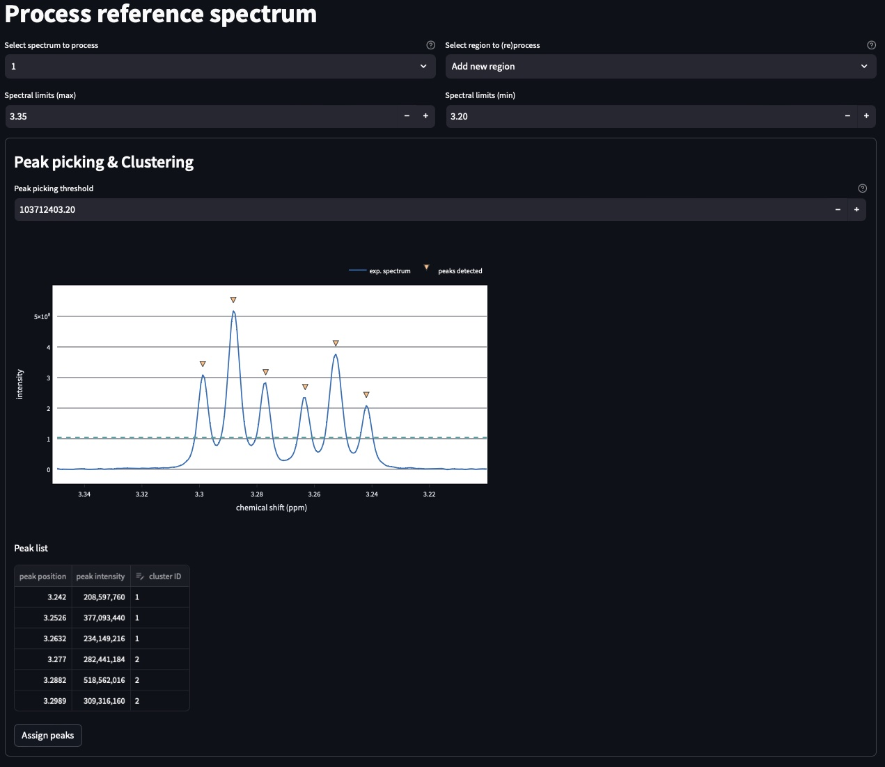

..  _Tutorials:

################################################################################
Tutorial
################################################################################

.. seealso:: If you have a question that is not covered in the tutorials, have a look
             at the :ref:`faq` or please contact us.

This tutorial will guide you through the different pages of MultiNMRFit interface. 

.. _Inputs & Outputs:

********************************************************************************
Inputs & Outputs
********************************************************************************

..  _`Data type`:

Data type
================================================================================
MultiNMRFit assumes that all the processing (base line correction, phasing, ...) is performed prior its usage.
MultiNMRFit can load 1D NMR data in 3 formats:

        * **Pseudo2D**: pseudo2D experiment (Bruker format only),
        * **list of 1Ds**: list of 1Ds acquired independently (Bruker format only), 
        * **txt data**: data from a text tabulated file (:file:'.txt' extension) with the following structure:

+-------+-------+-------+-------+
|  ppm  |   0   |  ...  |    n  |
+=======+=======+=======+=======+
|  0    | 1.2e3 |   ... | 1.2e6 |
+-------+-------+-------+-------+
|  0.1  | 1.3e3 |   ... |  4e7  |
+-------+-------+-------+-------+
|  0.2  |   2e8 |   ... | 3.6e3 |
+-------+-------+-------+-------+
|  ...  | ...   |   ... |  ...  |
+-------+-------+-------+-------+
|  12   |   3e4 |   ... | 7.85e3|
+-------+-------+-------+-------+

The column **ppm** is mandatory and contains the ppm scale assumes to be same for all spectra. 
The follwing columns here names **0** to **n** correspond to each individual spectra that will be loaded into MultiNMRFit

.. note:: **list of 1Ds**:  
        The list of  experiments should be provided as 
        * 1,8,109 : for non-consecutive 
        * 1-5 : for consecutive experiments (resulting in 1,2,3,4,5)
        * 1-5,109 : for a mix (resulting in 1,2,3,4,5,109) 

.. warning:: **list of 1Ds**  
        All the data needs to have the same number of points (**TD**) and the ppm scale identical. 
        If data were processes with different **SR** parameters in TopSpin it might shift one dataset to another.
        The ppm scale will be taken from the first experiment in the list.

..  _`Inputs/Outputs`:

Inputs/Outputs
================================================================================

:data_path: Path to the directory that contain the data
:data_folder: Folder containing your NMR data
:expno: List of experiments used in the MultiNMRFit analyis
:procno: Process number (e.g. procno in Topspin)

.. note:: **Inputs**:  
        The different fields will for inputs as described above will appear only for data type (**Pseudo2D** & **list of 1Ds**)
        For **txt data**, the text file must be loaded using the drag-and-drop menu. 

.. note:: **procno**:  
        If a list of **expno** is provided the **procno** needs to be same for all the **expnos**.

:output_path: path to the folder use to export the outputs
:output_folder: folder with the outputs
:filename: name of the pickle file containing the process that will be automatically saved through the workflow.

Load a processing file
================================================================================

Along the way the process is saved in a pickle format containing the entire process that was perfomed. 
The pickle file can be loaded using the drag-and-drop menu available in side bar of the Inputs & Outputs page. 

Once you are ready to load the spectrum, clicked the **Load Spectrum** buttom.

.. _Process ref. spectrum:

********************************************************************************
Process ref. spectrum
********************************************************************************

Once the data are correctly loaded the second page of the interface becomes available and allows use to perform the fitting of the reference spectrum:

The top part of this page automatically performs the peak picking on the reference spectrum within the region displayed in the graph:
* **Select reference spectrum**: Select one the spectrum of the list. Tis specturm (called reference spectrum) will be used for automatic peak detection and initial fitting. 
* **Select region to (re)process**: Multiple independent regions can be processed. Here, it will give you the choice of all regions added to the process.  
* **Spectral limits (max)**: Maximum of the spectral window (default is the maximum of the ppm scale)
* **Spectral limits (min)**: Minimum of the spectral window (default is the min of the ppm scale)

.. note:: **reference spectrum**:  
        The signal that you to analyze needs to be seen in the reference spectrum.
.. note:: **spectral limits**:  
        The difference betwwen the max and min should be at least 0.25 ppm.

You can adjust the **Peak picking threshold** to detect the desired peaks on the displayed spectrum. 

The **Peak picking threshold**

Configuration file
================================================================================

The configuration file contains all the required information to load the data (**Inputs** section), run the analysis (**Analysis** section), 
output the results (**Outputs** section). Users might alos be intersted to use some of the options (**Options** section). 
The configuration file is a json file (see example below) and contains all rows described below:

:download:`Example file <../multinmrfit/data/Imput_example.json>`.

.. topic:: About Analysis

          Two type of analysis type are provided **Pseudo2D** or **1D_Series**. In the case of **Pseudo2D** analysis a single *Experiments* should be given and all the 
          rows will be processes unless the *Data row no* is defined. The **1D_Series** analysis works for 1D 1H experiments acquired independently. This analysis should 
          also be used for a the fitting of a single experiment. *Experiments* might be defined as 1,2,3,4,5,6,7,8,9,10 (or 1-10) for sequential experiments and 1,5,6,7,8,9,10
          (1,5-10) for incomplete series. 

.. note:: Process Number 
         (e.g. "data_proc_no") should be the same for all experiments.

.. note:: Threshold
         Users will be able to update it through the graphical user interface is needed.

Options
--------------------------------------------------------------------------------
:Data row no: Options used in the case of incomplete processing of a Pseudo2D experiments, in which only a subset of rows need to be analyzed; e.g. "option_data_row_no"
:Use previous fit: Options for the analysis to use the fit of the row *i-1* as a starting parameter for the fitting of row *i*; e.g. "option_previous_fit"
:Offset: Adding an offset in the fitting (otherwise set to 0 by default); e.g. "option_offset"
:Merge pdf(s): Options used to merge all pdfs in a single file; e.g. "option_merge_pdf"

..  _`MultiNMRFit Analysis`:

MultiNMRFit Analysis
================================================================================

Data Loading
--------------------------------------------------------------------------------
The MultiNMRFit analysis is launched from a terminal (Windows: *Anaconda Prompt*) either by using 
the graphical user interface or the command line. In the first case, a interface will allow the user to 
fill all required information, save the configuration file and run the analysis. 

.. code-block:: bash
  multinmrfit 

In the second instance, the configuration file already exists and the analysis might be started from the command line.

.. code-block:: bash
  multinmrfit <path>/<*config_file.json*>

Data visualisation and clustering
--------------------------------------------------------------------------------
A second graphical interface will pop-up and will allow the user to define the multiplets to be analyzed.  
If the threshold needs to be re-evaluated (lower or higher), please change its value and update threshold. 

.. note:: Number of peaks
        Number of peaks is by default limited to 15.

The peaks detection is automatically performed on the reference spectrum and within the spectral range provided by the user in the first step. Only peaks with 
an assigned *Cluster ID* will be fitted later on (e.g. by leaving *Cluster ID* it means that the peak is not included in the analysis)

The mulitplicity of each cluster is automatically defined by the number of repetitions of the same *Cluster ID*
in the *Peak Picking visualisation and Clustering* interface. At the current stage of development we have implemented 
only a limited number of multiplicity:

:1 peak: Singlet
:2 peaks: Doublet
:3 peaks: Triplet
:4 peaks: Quadruplet 

.. note:: Cluster ID
        might be defined by integers or string (*xx* for instance)

.. note:: Strong coupling
        is included for a quadruplet by setting the options *Roof* in the menu of one of the 4 rows defined with the *Cluster ID*.

Fitting
--------------------------------------------------------------------------------
The fitting procedure starts with the minimization of the reference spectrum with the sum of all the multiplicty defined by the user. 
This initial minimization procedure uses the results of the peak picking as starting point for the position, intensities and coupling constants. 
Each multiplicity is defined a sum of signals that are themselves calculated as a weighted average of a lorentzian and gaussian functions reprensented with the parameter *a*. 

The procedure then optimized the **linewidth** of the Signals (e.g. "lw"), the **ratio** lorentzian/gaussian (e.g. "a"), the **amplitude** (e.g. "Amp"), 
the **center position** of the multiplet (e.g. "x0") and the different **coupling constants** (e.g. "J1, J2").

The series of spectra is then divided in two groups: above and below the reference spectrum and will be fitted in parallel. A interface will whow the progress 
of the analysis in real-time. If the option *option_previous_fit* is selected (by default for a *Pseudo2D* analysis) the fitting of the a spectra *i* will use 
starting parameters the final results of *i-1* otherwise it will always use the results of the reference spectrum as the initial parameters. The use of this option also restrained 
the change of parameters between 2 spectra with for instance J within 5% of the previous value, x0 within 1% and lw within 30%. 

.. note:: Use previous fit
        option is worth using even for a 1D_Series if these data are time dependent for instance. 

Once the complete analysis is done the program will automatically generate text files and plot the data. Progress are shown in the terminal (Windows: *Anaconda Prompt*).

..  _`Output data`:

Output files
================================================================================

Result file
--------------------------------------------------------------------------------
All output are located in the <*Output folder*> 

Result file(s) are txt files name as <*Output name*>_<*multiplicity*>_<*cluster_id*>.txt:
If multiple clusters are defined by the user one file per multiplets is created and they all contain the following columns:

:exp_no: experiments number 
:proc_no: processing number
:row_id: row number in the Pseudo2D experiments (set as *1* for 1D_Series)
:x0, a, Amp, lw, J1, .., integral: fitting parameters 
:x0_err, a_err, Amp_err, lw_err, J1_err, .., integral_err: error on fitting parameters estimated from covariance matrix
:offset: offset to the baseline if the option is selected 

Result file
--------------------------------------------------------------------------------

All individual plots are displayed in <*plot_ind*> folder which is automatically created. 
If the option *Merge pdf(s)* is selected a single file is created in <*Output name*>_<*Spectra_Full*>.pdf

--------------------------------------------------------------------------------

A log file is created in the same directory <*Output name*> to store all parameters (for reproducibility),
in file a *process.log*.

Warning and error messages
--------------------------------------------------------------------------------

Error messages are explicit. You should examine carefully any warning/error message.
After correcting the problem, you might have to restart MultiNMRFit (to reload files)
and perform the analysis again.
