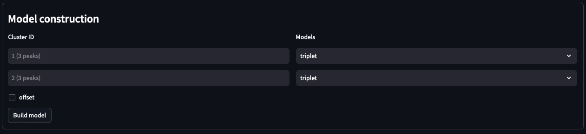
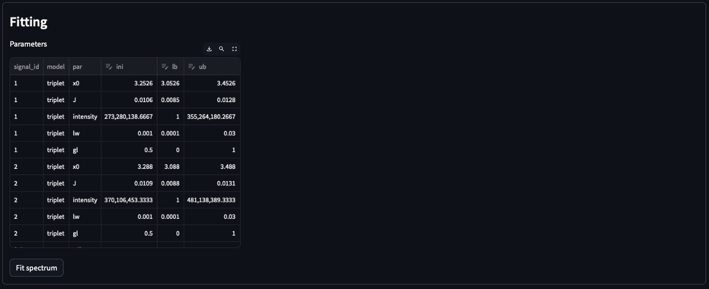
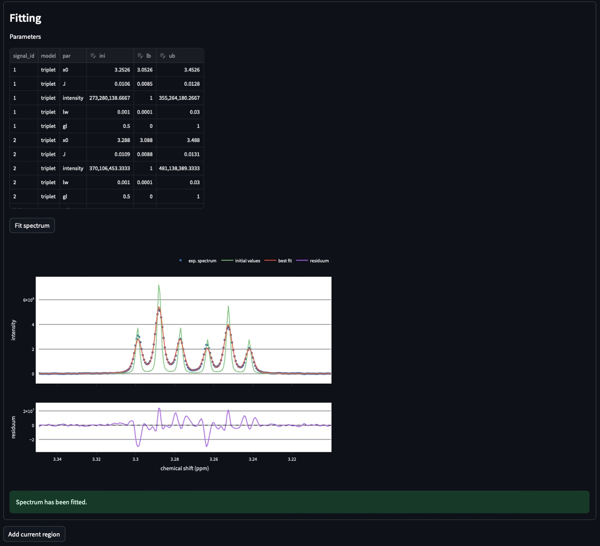
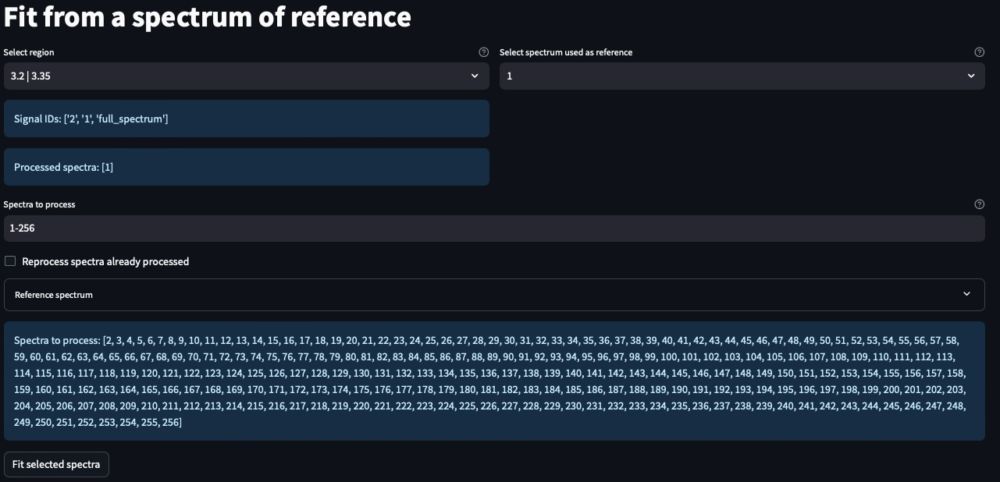
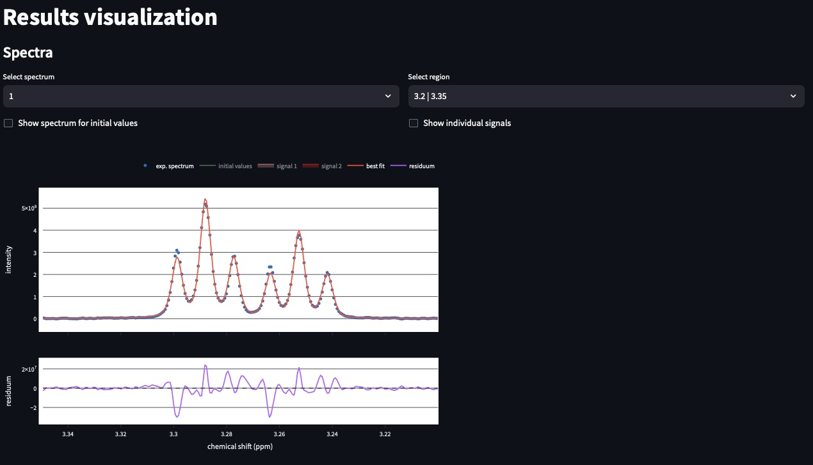
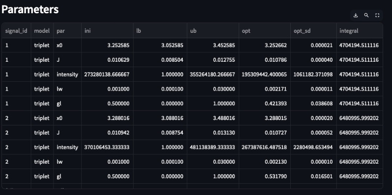
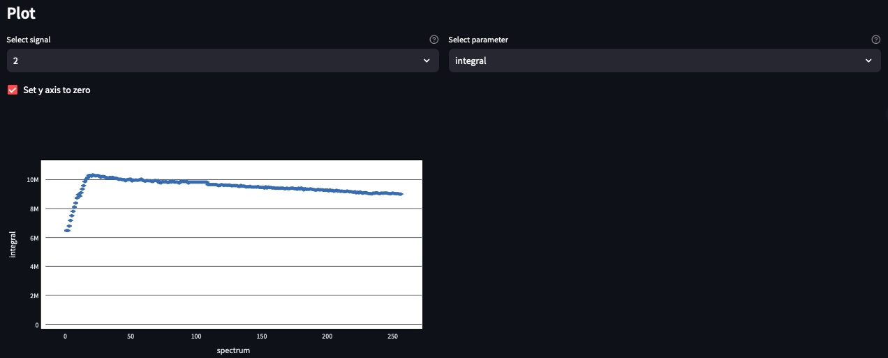

..  _Tutorials:

################################################################################
Tutorial
################################################################################

.. seealso:: If you have a question that is not covered in the tutorials, have a look
             at the :ref:`faq` or please contact us.

This tutorial will guide you through the different pages of MultiNMRFit. 

.. _Inputs & Outputs:

********************************************************************************
Input data
********************************************************************************

..  _`Data type`:

Data type
================================================================================
MultiNMRFit requires that the main spectrum processing steps (baseline correction, phasing, ...) have been performed beforehand.
MultiNMRFit can load 1D NMR data provided in the following formats:

        * **Pseudo2D**: pseudo2D experiment (Bruker format only),
        * **list of 1Ds**: 1Ds spectra acquired independently (Bruker format only), 
        * **txt data**: data from a text tabulated file (:file:'.txt' extension) with the following structure:

+-------+-------+-------+-------+
|  ppm  |   0   |  ...  |    n  |
+=======+=======+=======+=======+
|  0    | 1.2e3 |   ... | 1.2e6 |
+-------+-------+-------+-------+
|  0.1  | 1.3e3 |   ... |  4e7  |
+-------+-------+-------+-------+
|  0.2  |   2e8 |   ... | 3.6e3 |
+-------+-------+-------+-------+
|  ...  | ...   |   ... |  ...  |
+-------+-------+-------+-------+
|  12   |   3e4 |   ... | 7.85e3|
+-------+-------+-------+-------+

The column **ppm** is mandatory and contains the ppm scale, columns named **0** to **n** correspond to each individual spectra.

.. note:: **list of 1Ds**:  
        The list of  experiments should be provided as e.g.
        * 1,8,109 : for non-consecutive spectra (here spectra 1,8,109)
        * 1-5 : for sequential spectra (here spectra 1,2,3,4,5)
        * 1-5,109 : a mix of both formats for incomplete series (here spectra 1,2,3,4,5,109) 

..  _`Inputs/Outputs`:

Inputs & outputs paths
================================================================================

:data_path: Path to the directory that contain the data
:data_folder: Folder containing your NMR data
:expno: List of Experiments which contain the spectra (i.e. expno in Topspin)
:procno: Process number (i.e. procno in Topspin)

.. note:: **Inputs**:  
        The different fields will for inputs as described above will appear only for data type **Pseudo2D** & **list of 1Ds**. 
        For **txt data**, the text file must be loaded using the drag-and-drop menu. 

.. note:: **procno**:  
        If a list of **expno** is provided the **procno** must be same for all **expnos**.

:output_path: Path to the folder use to export the outputs
:output_folder: Folder name
:filename: Name of the pickle file containing the process that will be automatically saved

Load a processing file
================================================================================

Current status of the process is continuously saved in a pickle file containing the entire process that has been perfomed. 
The pickle file can be loaded using the drag-and-drop menu available in side bar of the Inputs & Outputs page. 

Once you have selected the process file, clicked on **Load Spectrum**.

.. _Process ref. spectrum:

********************************************************************************
Fit a spectrum
********************************************************************************

Once the data are correctly loaded the second page of the interface becomes available and 
allows use to fit one or several signals contained in a specific region of a given spectrum:

.. image:: _static/Set_ref_processing.jpg
  :scale: 60%

The top part of this page automatically performs peak picking on the reference spectrum within the region displayed in the plot:
* **Select spectrum**: Select one the spectrum of the list. 
* **Select region to (re)process**: Multiple independent regions can be processed. Here, it will give you the choice of all regions already processed.  
* **Spectral limits (max)**: Maximum of the spectral window (default is the maximum of the ppm scale)
* **Spectral limits (min)**: Minimum of the spectral window (default is the min of the ppm scale)

.. note:: **spectral limits**:  
        A region should be at least 0.025 ppm wide.

You can adjust the **Peak picking threshold** to detect the peaks of interest on the displayed spectrum. 

While adjusting this threshold the software will automatically display a dataframe **Peak list** with the detected peaks in the region (marked with a yellow triangle on the spectrum).
The peaks are displayed in the ascending order (e.g. from right to left on the spectrum). You can also add peaks mannually by entering their chemical shifts and click on "Add peak".

You can now proceed with the clustering steps that consists in grouping peaks of a given signal. For this purpose, fill the **cluster ID** column of the **Peak list**. Peaks that belongs to the same multiplets 
must have the same names.

.. note:: **cluster ID**:  
        Cluter IDs can be anything (numbers, strings, etc).

Once clustering has been performed, click **Assign peaks** to move towards the model construction step:

For each cluster MultiNMRFit will provide a list of all signal models that correspond 
to a signal containing the corresponding number of peaks. You can also choose to add an offset, which corresponds to a first-order 
phase correction on the selected window. Once this step is done, you can click on **Build model** 
to automatically create the spectrum model and display the table of initial parameters.

Intitial values are calculated based on [i] the results of the peak picking (intensities and peak position) [ii] the default parameters of the each model
(look at :doc:`models.rst` for more details on the default parameters). If no changes are required press the **Fit spectrum** button to proceed with the minimization
of the reference spectrum. 

.. note:: **Parameters**:  
        All parameters are shown in **ppm** units.

The fitted spectrum will be automatically displayed on the resulting plot. This plot shows [i] the experimental data as dots [ii] the best fit 
as red a curve and [iii] the initial values in green. The residuals plot (i.e. difference between the fitted and the experimental spectra) is shown below.

.. note:: **Parameters**:  
        In the case of mismatch between the data and the best fit, you can adjust manually adjust the initial values in the former **parameters** table.

If the results are satisying, click on **Add current region** to save this region. 
To add another region, go to the top of page and select **add new region** in the field **Select region to (re)process**. Otherwise move to next page **Fit from reference**. 

.. _Fit from reference:

********************************************************************************
Batch analysis
********************************************************************************

This page contains the wrapper that allows you to fit several spectra in batch based on an already processed spectrum (used as reference). 

First select the region that you want to fit (**Select region**). MultiNMRFit will display the list of **Signal IDs** present in the selected region
along with the **processed spectra** already analyzed.

Select the spectra you want to fit. By default it shows the complete dataset (here 1-256 as the pseudo2D contains 256 in the example).
However if you want to analyze only the first ten spectra one can enter '1-10' and multiNMRFit will update the list **spectra to process** automatically. Click the **Fit selected spectra**
to run the fitting of the selected spectra. The progress of the fitting will be displayed by a progress bar and once complete a message **All spectra have been fitted** will appear.

.. note:: **Fitting**:  
        This procedure can be repeated for the different regions defined in the previous pages upon selection in **Select region**.
        By default MultiNMRFit do not reprocess spectra that have been already been fitted so clicked the option if necessary.
        The reference spectrum associated with the selected region can be visualized on this page. 

.. _Results visualisation:

********************************************************************************
Results visualisation and export
********************************************************************************

This page provides several visualization options of the results. On top, you can inspect all fitted regions and spectra. 
If multiple signals were fitted on the same region, you can observe each one by clicking on the different 
signal IDs in the figure caption.

..  _`Spectra visualisation`:

Spectra visualisation
================================================================================

Users can select the spectrum and the region to display. 

..  _`Parameters visualisation`:

Parameters visualisation
================================================================================

For the corresponding spectra shown above users can find the table of paramters. 
A particular attention must me given to the **opt** that contains the estimated values.  

Finally, users can observe the change of a given paramters as function of spectra IDs. 

Export results
================================================================================

Users can export their results tabulated text file in two different manners: **all data** or **specific data**
In the first case (**all data**) all the parameters of all the regions and spectra will be saved in the **output** location 
defined in the first page of the interface. If the second case (option **specific data** selected), you can select one region, one parameter that will 
exclusively saved in the file.  

Warning and error messages
--------------------------------------------------------------------------------

Error messages are explicit. You should examine carefully any warning/error message.
After correcting the problem, you might have to restart MultiNMRFit (to reload files)
and perform the analysis again.
